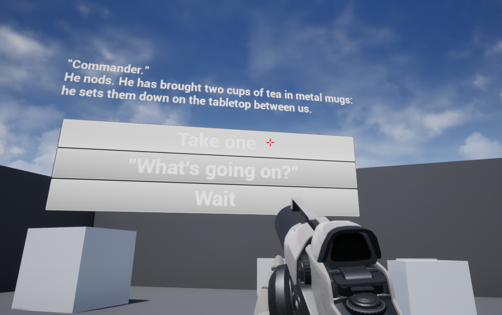
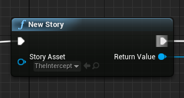

# Unreal Ink

This is a plugin allowing you to use the excellent dynamic narrative scripting system, Ink, in Unreal Engine. [Visit the Ink repository for more information on it.](https://github.com/inkle/ink) The plugin still is ostensibly finished. All of the features of the C# API are available except for the profiler, which isn't hugely important. Also the ink runtime itself is up to date and fully featured. Please don't hesistate to contact me for any problems or help you need. I live at @dave_colson on twitter and you can email me at davidcncolson@gmail.com.

As of current master branch, compatible with Ink 0.9.0.

# How to use 

I have provided packaged versions of the plugin, complete with the example project. I try keep it updated for the most recent versions of Unreal, if it's not updated poke me and I can do it for you. Simply drop the packaged plugin into the plugins folder of your engine or game. Once loaded it into your project, you can use the plugin either through C++ or more easily through blueprints. First though we need to go over importing Ink assets. 

## Importing Ink Assets

The plugin provides a new asset that represents ink stories (`UStoryAsset`). You can import plain .ink files and the plugin will automatically compile them for you. This way you can set up auto-reimporting of the ink files which will be recompiled on import. Simply import the .ink file as you would any other file.

## Use through blueprints

After importing your .ink file, you can create a new story node and select your story asset in the dropdown.

This will return a story instance, which can then be used just like as is shown in the [inkle documentation](https://github.com/inkle/ink/blob/master/Documentation/RunningYourInk.md) files. The idea is that there's a node for every function available in the Ink API, though a few are missing.

I have provided an example project demonstrating a basic usage of the system, which only uses blueprints, so go check that out.

## Use through C++

It's very similar to the blueprints here as well. Load a story asset file, call `UStory::NewStory();` and then all existing function calls are basically the same as in the Inkle library, with a couple of exceptions (variadic functions). I will provide an example of this soon. For now take a look at the `Story.h` file for a list of possible function calls.

# How does it work?

It works by embedding the Mono runtime directly into the plugin in Unreal, and then has a special C# assembly called InkGlue, which marshalls data and function calls between C# and C++ to lessen the amount of complicated binding code present in C++. It requires linking with mono, and since I've only got a windows PC currently I've provided the windows mono library. Theoretically it'll work fine on Mac, you just need to link the mono-sgen dynlib.

## Platform support

- Windows - First class support
- Mac - I have setup the build scripts to support Mac, and I've provided the third party dlls so that it'll work, but I don't have a Mac so this is untested. **Seeking people with a Mac to help me test this**
- Consoles - Mono is stated to work on PS4 and Xbox One/Series X but I have no access to dev kits so I cannot test this. Theoretically it would just involve linking the appropriate mono library, and including matching core assemblies that you've compiled with mono.
